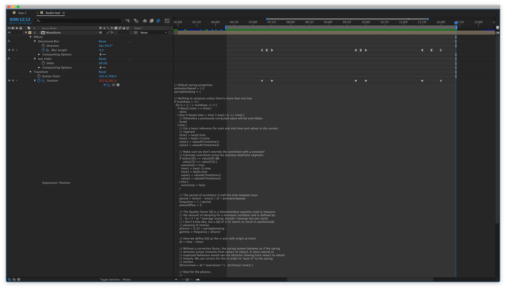
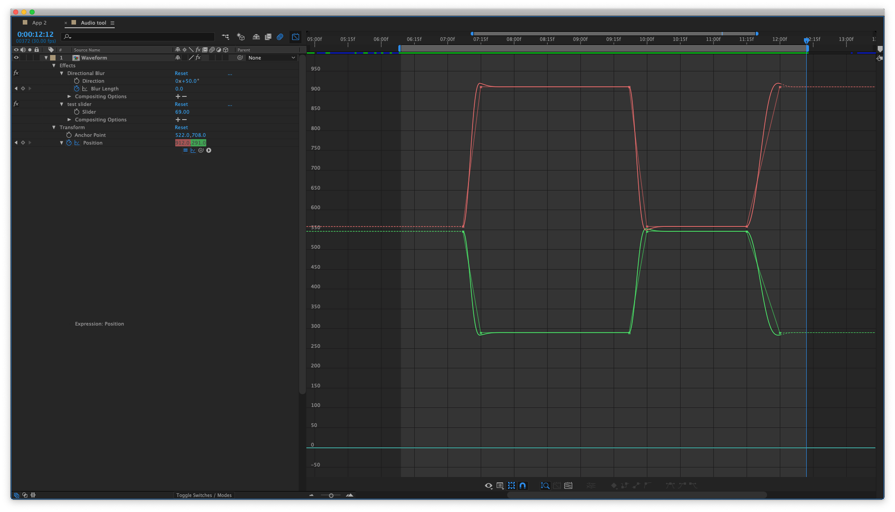
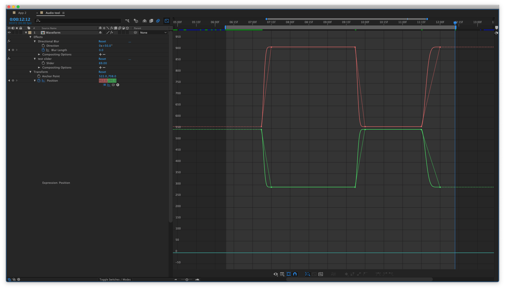
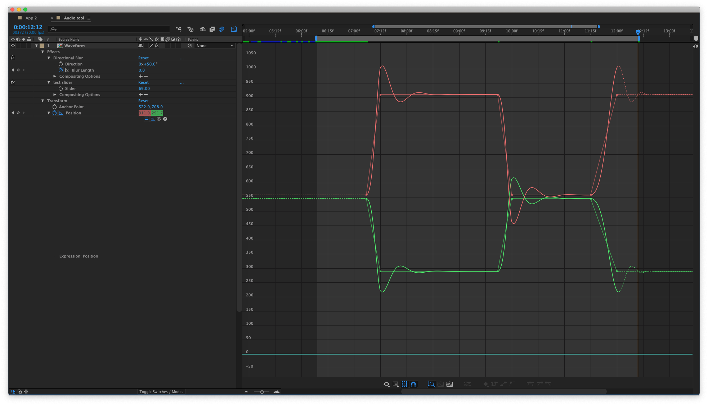
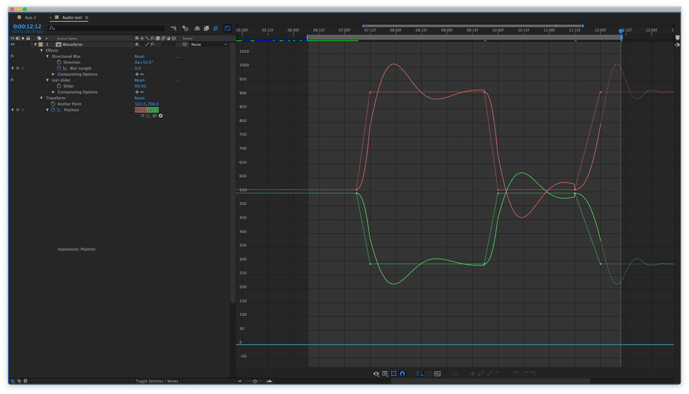

# after-effects-utilities
For the moment, this repository only has one useful expression: spring-easing.

## spring-easing
Other implementations of spring dynamics I have found are incredibly inefficient, bringing my new macbook pro down to its knees. This implements the analytic solution to the energy equations of damped harmonic oscillators, solved for position over time instead of requiring computationally inefficient recursion. For more information about the relevant physics and the analytic solution, see [this course outline](http://people.physics.tamu.edu/agnolet/Teaching/Phys_221/MathematicaWebPages/4_DampedHarmonicOscillator.pdf).

Simply copy-paste the entire expression wherever a property needs to be springy. Leave keyframe interpolation as "linear".

Example: applying the expression to position keyframes

Result with `animationSpeed = 1.2` and `springDamping = 1`:

Result with `animationSpeed = 1.2` and `springDamping = 3`:

Result with `animationSpeed = 1.2` and `springDamping = 0.3`:

Result with `animationSpeed = 0.5` and `springDamping = 0.3`:

